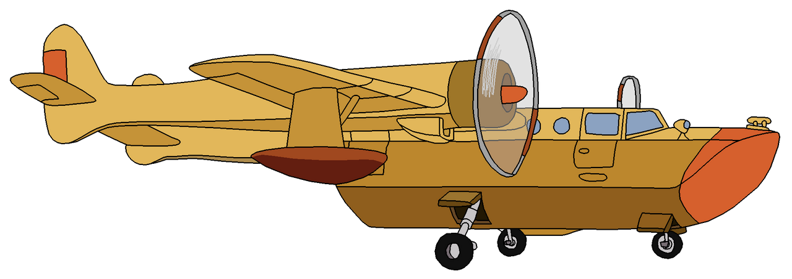

This repository contains all the magic needed to containerize a
control plane (a SEA PLANE) on Kubernetes.

All you need to bring with you is:

  1. A Kubernetes cluster
  2. A default storage class
  3. A willingness to try new things

Enjoy!
